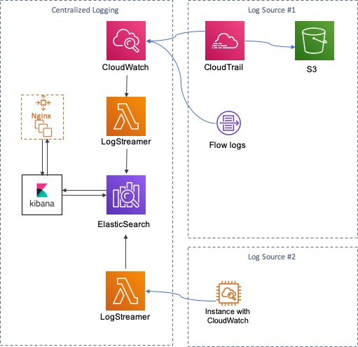

# AWS Centralized Logging Solution
The AWS Centralized Logging Solution is a reference implementation that provides a foundation for logging to a centralized account in China regions. The solution is forked from https://aws.amazon.com/solutions/centralized-logging/, which is the best fit for global offering.

Customers can leverage the solution to index CloudTrail Logs, CW Logs, VPC Flow Logs on a ElasticSearch domain. The logs can then be searched on different fields.


## Architectural design

See following architecture as changed edition.




## Quick start

1. Generate key pair through admin console or awccli.
```
$ aws ec2  create-key-pair --key-name nginx-keypair
```
The output is an ASCII version of the private key and key fingerprint. You need to save the key (KeyMaterial) to a file.


2. Hit [](https://cn-northwest-1.console.amazonaws.cn/cloudformation/home?region=cn-northwest-1#/stacks/new?&templateURL=https://aws-solutions-reference.s3.cn-north-1.amazonaws.com.cn/aws-centralized-logging/v1.1/centralized-logging-primary-china.template) to quick launch in Chinese regions.

## Notice
1. Add addtional user to access Kinbana.
```
# format// user:password
$ echo ${ProxyUsername}:`openssl passwd -apr1 ${ProxyPass}` >> /etc/nginx/conf.d/kibana.htpasswd
```
2. Adjust buffer for proxy.
3. Replace certificate for proxy server.
```
# replace certificate
$ cp new_certificate /etc/nginx/cert.crt
# replace certificate key
$ cp new_certificate_key /etc/nginx/cert.key
```


## Running unit tests for customization
* Clone the repository, then make the desired code changes
* Next, run unit tests to make sure added customization passes the tests
```
cd ./deployment
chmod +x ./run-unit-tests.sh  \n
./run-unit-tests.sh \n
```

## Building distributable for customization
* Configure the bucket name of your target Amazon S3 distribution bucket
```
export TEMPLATE_OUTPUT_BUCKET=my-bucket-name # bucket where cfn template will reside
export DIST_OUTPUT_BUCKET=my-bucket-name # bucket where customized code will reside
export VERSION=my-version # version number for the customized code
```
_Note:_ You would have to create 2 buckets, one with prefix 'my-bucket-name' and another regional bucket with prefix 'my-bucket-name-<aws_region>'; aws_region is where you are testing the customized solution. Also, the assets  in bucket should be publicly accessible

* Now build the distributable:
```
chmod +x ./build-s3-dist.sh \n
./build-s3-dist.sh $DIST_OUTPUT_BUCKET $TEMPLATE_OUTPUT_BUCKET $VERSION \n
```

* Deploy the distributable to an Amazon S3 bucket in your account. _Note:_ you must have the AWS Command Line Interface installed.
```
aws s3 cp ./dist/ s3://my-bucket-name/centralized-logging/<my-version>/ --recursive --exclude "*" --include "*.template" --include "*.json" --acl bucket-owner-full-control --profile aws-cred-profile-name \n
aws s3 cp ./dist/ s3://my-bucket-name-<aws_region>/centralized-logging/<my-version>/ --recursive --exclude "*" --include "*.zip" --acl bucket-owner-full-control --profile aws-cred-profile-name \n
```

* Get the link of the centralized-logging-primary.template uploaded to your Amazon S3 bucket.
* Deploy the AWS Centralized Logging Solution to your account by launching a new AWS CloudFormation stack using the link of the centralized-logging-primary.template.


## Todo
 - [x] Building universe collecting layer to integrate various log sources and destinations.
 - [x] Customizable dashboard for classic applications with AWS practices.


***

Copyright 2019 Amazon.com, Inc. or its affiliates. All Rights Reserved.

Licensed under the Apache License Version 2.0 (the "License"). You may not use this file except in compliance with the License. A copy of the License is located at

    http://www.apache.org/licenses/

or in the "license" file accompanying this file. This file is distributed on an "AS IS" BASIS, WITHOUT WARRANTIES OR CONDITIONS OF ANY KIND, express or implied. See the License for the specific language governing permissions and limitations under the License.

